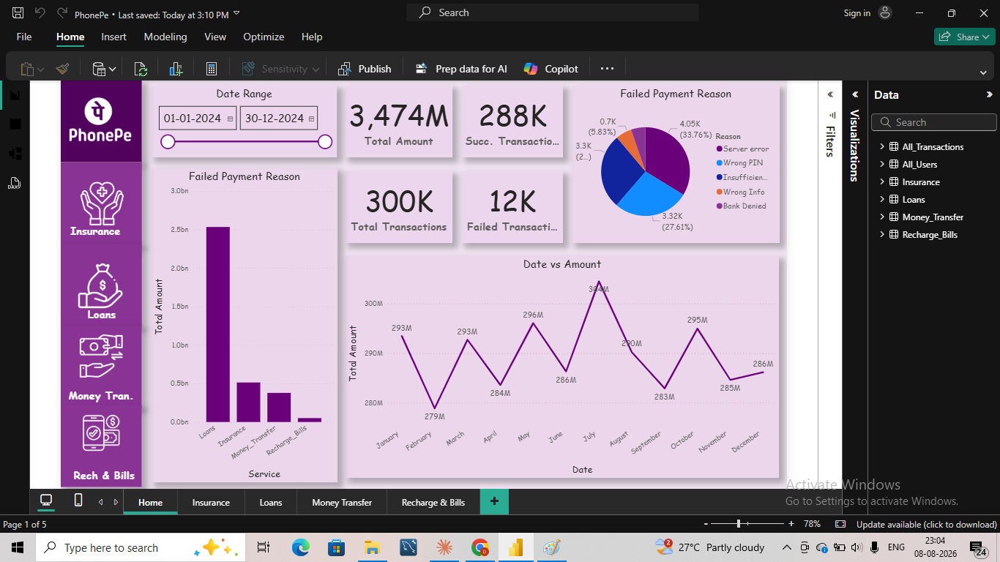
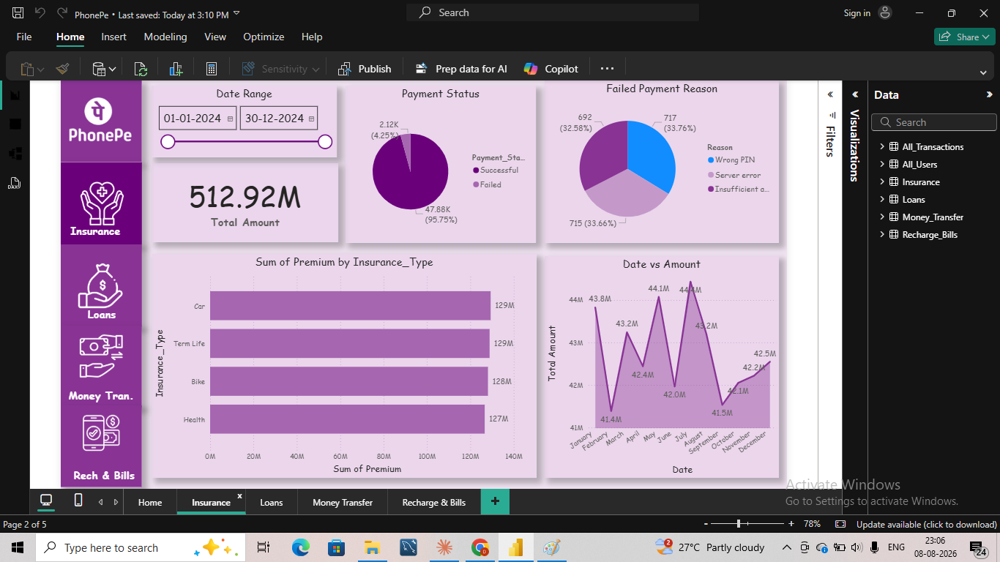
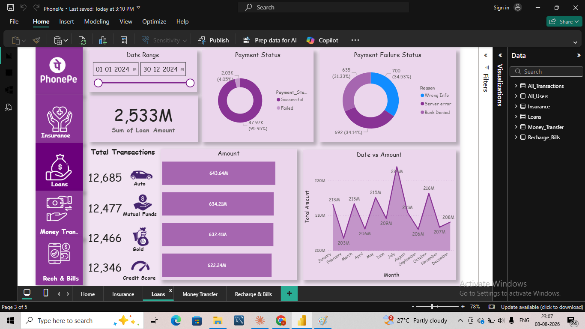
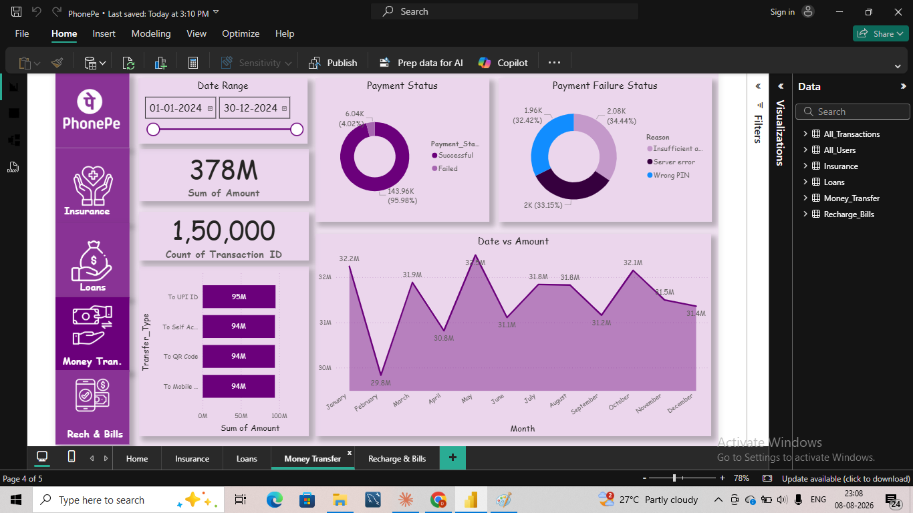
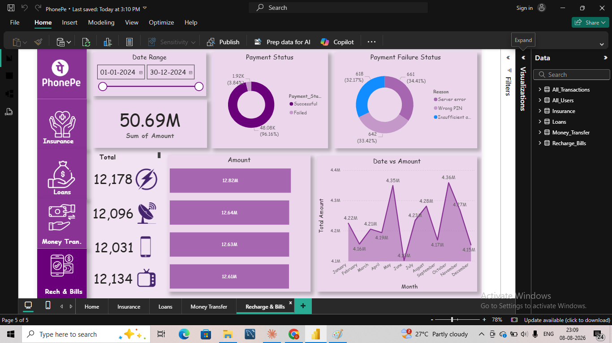

# PhonePe Transaction & Customer Analytics Dashboard

## Project Overview

An analysis of a large-scale, **PhonePe-style digital payments dataset** (110K+ users, 300K+ transactions, 2024 data) covering four core services: **Money Transfer, Recharge & Bills, Loans, and Insurance**.

> **Note:** This project uses a synthetic/practice dataset modeled on digital payment transaction data (not proprietary PhonePe data), used here for analytical and portfolio purposes.

Built entirely in **Power BI**, the dashboard spans 5 pages — a Home overview plus a dedicated page per service — to answer questions about transaction volume, revenue, failure patterns, and service-level performance.

---

## Dashboard

### Home

### Insurance

### Loans

### Money Transfer

### Recharge & Bills

---

## Key Questions (KPIs)

1. What is the total transaction volume and value across all services?
2. How does transaction **count** compare to transaction **value** across services?
3. What is the overall payment success/failure rate, and what causes failures?
4. Which service generates the highest revenue, and which generates the highest order count?
5. How do amounts trend month-to-month across each service?
6. Which sub-categories (loan types, insurance types, transfer types, bill types) drive the most volume within each service?

---

## Key Insights

- **Total transaction value across all services: ₹3,474M**, split as Loans ₹2,533M, Insurance ₹512.92M, Money Transfer ₹378M, and Recharge & Bills ₹50.69M.
- **Overall success rate is 96%** (288K successful of 300K total transactions), consistent across every individual service (95.75%–96.16%).
- **Volume and value tell opposite stories.** Money Transfer accounts for **50% of all transactions** (150,000 of 300,000) but only **~11% of total value** (₹378M). Loans, by contrast, are just **~17% of transaction count** (50,000) but drive **~73% of total value** (₹2,533M). This is the single clearest finding in the dataset: a business optimizing for "most transactions" and a business optimizing for "most revenue" would focus on two completely different services.
- **Failure causes are evenly split, not dominated by one issue.** Across every service, the top 3 failure reasons (Server error, Wrong PIN/Info, Insufficient funds/Bank Denied) each account for roughly 30–35% of failures — no single root cause explains the majority of failed payments, which suggests failure reduction efforts need to address multiple causes in parallel rather than one fix.
- **Within-service sub-categories are remarkably balanced.** Loan types (Auto, Mutual Funds, Gold, Credit Score), insurance types (Car, Term Life, Bike, Health), transfer types (UPI ID, Self Account, QR Code, Mobile), and bill types (Electricity, DTH, Mobile, TV/Broadband) each split close to evenly within their service — none show one sub-category dominating.
- Monthly transaction value is **relatively stable year-round** across all services, with no extreme seasonal spikes — Loans shows the most month-to-month variation (peaking in July).

---

## Process

1. **Data Cleaning** — Prepared and structured the raw transaction dataset for modeling.
2. **Data Modeling** — Built relationships across transaction, user, and service-type tables in Power BI.
3. **DAX Measures** — Created measures for success rate, failure rate, and service-level aggregations.
4. **Visualization** — Built a 5-page interactive dashboard (Home + 4 service pages) with KPI cards, trend lines, and failure-reason breakdowns, filterable by date range.

---

## Tools & Skills Used

Power BI · DAX · Data Cleaning · Data Modeling · Data Visualization · Business Analysis

---

## Dataset

The raw dataset (110K+ users, 300K+ transactions) is not included in this repository due to file size. Below is a summary of the schema used across the four service tables:

| Column | Description |
|---|---|
| Transaction ID | Unique identifier for each transaction |
| User ID | Unique identifier for each user |
| Date | Transaction date (Jan–Dec 2024) |
| Amount | Transaction value |
| Payment Status | Successful / Failed |
| Failure Reason | Server error / Wrong PIN / Insufficient funds / Bank Denied / Wrong Info (where applicable) |
| Service | Money Transfer / Recharge & Bills / Loans / Insurance |
| Sub-category | e.g. Loan type (Auto, Mutual Funds, Gold, Credit Score), Insurance type (Car, Term Life, Bike, Health), Transfer type (UPI ID, Self Account, QR Code, Mobile), Bill type (Electricity, DTH, Mobile, TV/Broadband) |

---

## Contact

**Rajan Kumar**
Data Analyst | SQL · Excel · Power BI · Python

🔗 [GitHub](https://github.com/Rajankumar19) · [LinkedIn](https://www.linkedin.com/in/rajan-kumar224) · 📧 oliverjain829@gmail.com
